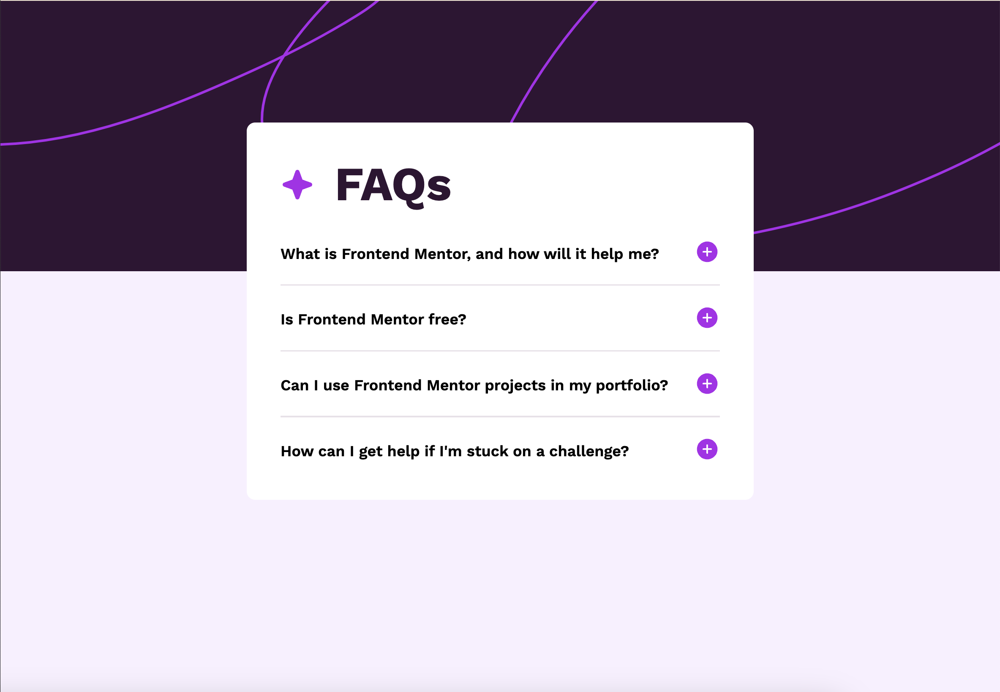

# Frontend Mentor - FAQ accordion solution

This is a solution to the [FAQ accordion challenge on Frontend Mentor](https://www.frontendmentor.io/challenges/faq-accordion-wyfFdeBwBz). Frontend Mentor challenges help you improve your coding skills by building realistic projects.

## Table of contents

- [The challenge](#the-challenge)
- [Screenshot](#screenshot)
- [Links](#links)
- [Built with](#built-with)
- [What I learned](#what-i-learned)

## Overview

### The challenge

Users should be able to:

- View the optimal layout for the site depending on their device's screen size

### Screenshot

### Links

- Solution URL: [https://github.com/tunaerten/card-component]
- Live Site URL: [https://card-component-erten.netlify.app]

## My process

### Built with

- Semantic HTML5 markup
- CSS custom properties
- Flexbox
- CSS Grid
- Mobile-first workflow

### What I learned

This project was helpful for recognizing new HTML semantic elements. I also had the opportunity to familiarize myself with using ARIA labels. After completing the project, I tested it with Lighthouse and Axe DevTools, becoming more accustomed to these tools. Although the project was quite simple, I learned a lot of new things.
